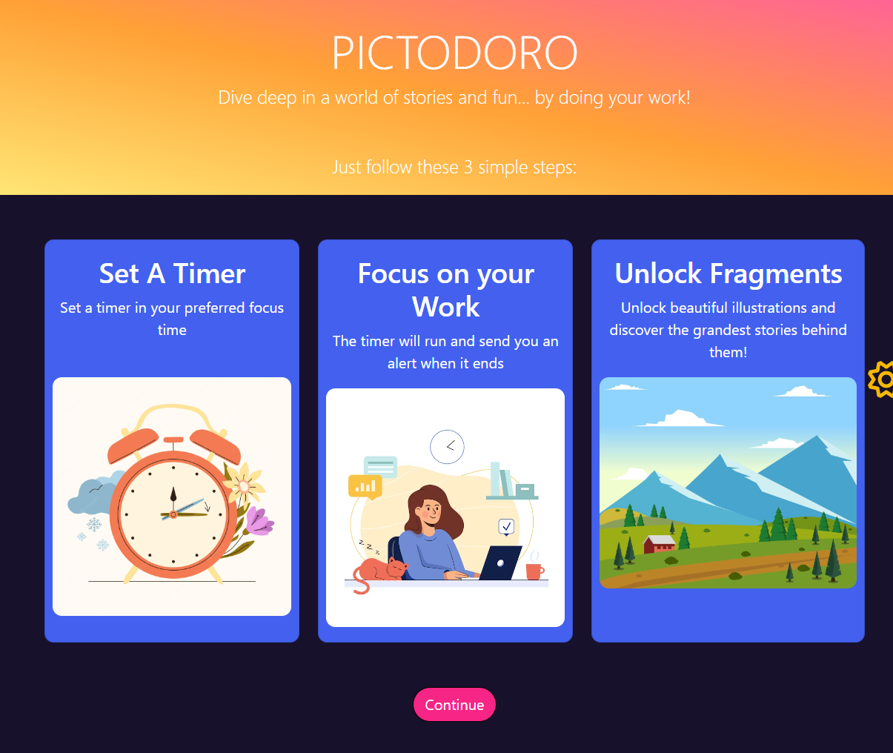
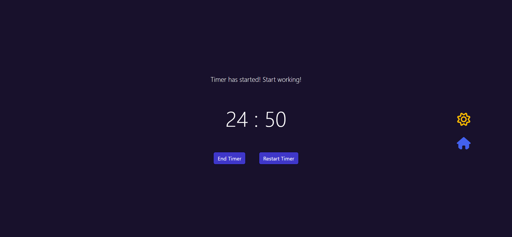
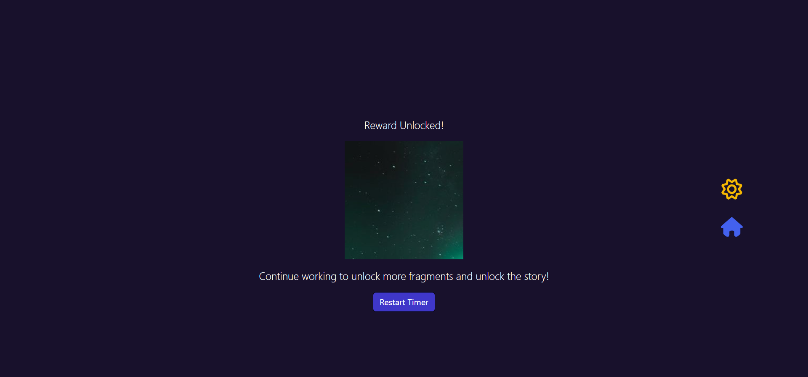
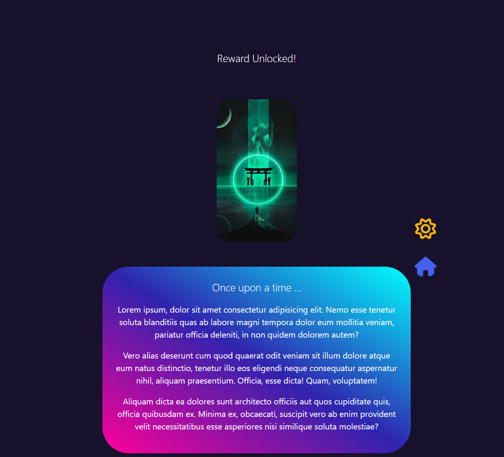

# ⏰ PictoDoro

This is a project for an active participation to the hackathon Diversion 2023 - in domain of Web De0velopment

## Description

PictoDoro is a uniquely gamified web based pomodoro timer. 
- For each successful completion of focus block, the user gets rewarded with puzzle pieces of an illustration. 
- Once the user focuses for certain blocks of time (for eg. 9 sessions of 25min), the full illustration and a corresponding story is rewarded - which is both relaxing and minimal time consuming.

## Built with 

- Semantic HTML5
- CSS3
- Javascript
- Bootstrap

## Live Site

https://embertseal.github.io/PictoDoro/index.html

## Screenshots

### Landing Page

### Timer Selection 

### Timer Running 

### Focus Block Reward

### Complete Reward

### Author
- [Trisha Seal](https://github.com/EmberTSeal)
- [Ahana Mohanta](https://github.com/Amohanta0019)
- [Arnab Bose](https://github.com/Arnab-129)
